# Тема 1-2. Апаратне забезпечення персонального комп'ютера

**План:**
- Правила електробезпеки при роботі з внутрішніми компонентами ПК
- Форм-фактори корпусів настільних комп'ютерів
- Блок живлення - основні характеристики, конектори блоку живлення.
- Основні компоненти материнської плати

---

## 1. Правила електробезпеки при роботі з внутрішніми компонентами ПК

Робота з комп'ютерним обладнанням вимагає суворого дотримання правил безпеки для запобігання травмам та пошкодженню компонентів.

### Основні загрози та правила:
* **Висока напруга:** Деякі пристрої, такі як блоки живлення та лазерні принтери, містять компоненти під високою напругою.
  > Деякі компоненти зберігають високу напругу навіть після відключення пристрою від мережі.
  >
  > 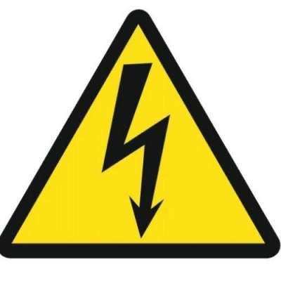
* **Заземлення:** Усе електрообладнання повинно бути заземлене. Заземлення створює шлях струму з найменшим опором, захищаючи користувача у випадку несправності. Зазвичай комп'ютер заземлюється через штекер живлення.
    > 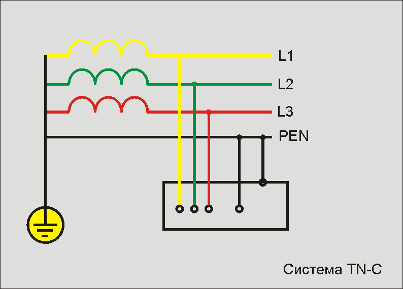
* **Адаптери живлення:** Використовуйте тільки оригінальні адаптери змінного струму, оскільки заміна на несумісний тип може пошкодити як адаптер, так і ноутбук.
  > 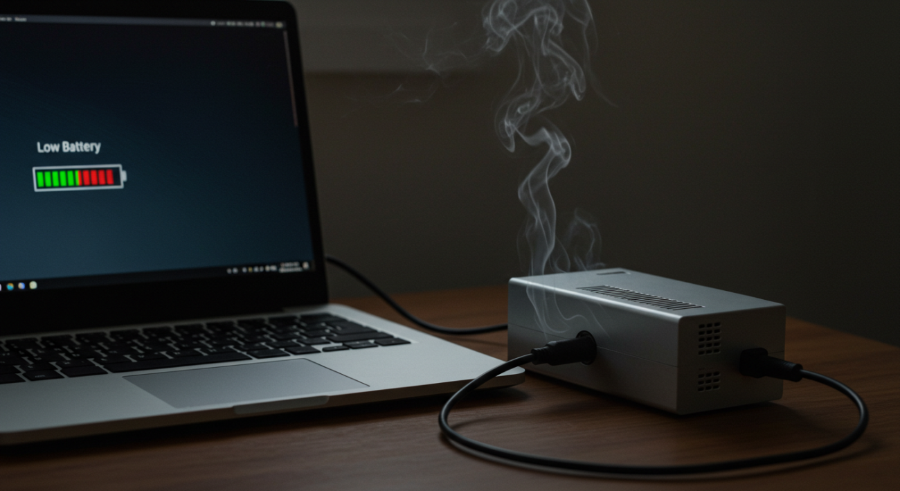

### Електростатичний розряд (ESD)
Електростатичний розряд виникає при контакті двох поверхонь з різним електричним зарядом.

* **Поріг чутливості:**
    * Людина відчуває розряд напругою від **3000 В**.
    * Біль або шум виникає при напрузі вище **10000 В**.
    * Комп'ютерні компоненти можуть бути пошкоджені напругою менше **30 В**.
* **Методи захисту від ESD:**
    * Зберігайте компоненти в антистатичних мішках до моменту встановлення.
    * Використовуйте заземлені килимки на робочому столі та підлозі.
    * Використовуйте **антистатичні браслети** при роботі з внутрішніми компонентами.
    * Само-заземлення: доторкніться до заземленого металевого корпусу перед початком роботи.

> 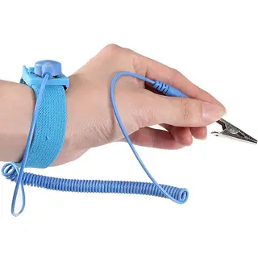

---

## 2. Форм-фактори корпусів настільних комп'ютерів

Корпус комп'ютера забезпечує каркас для підтримки, захисту та охолодження внутрішніх компонентів. Повітря, проходячи через корпус, поглинає тепло від компонентів і виводить його назовні.

### Основні типи корпусів:
1.  **Горизонтальний корпус (Horizontal case):** Розташовується на столі горизонтально (часто монітор ставлять зверху). Популярний у ранніх системах, зараз часто використовується для домашніх кінотеатрів (HTPC).
   > 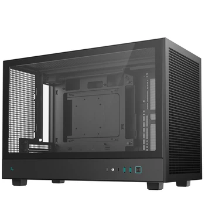
2.  **Повнорозмірна вежа (Full-Size Tower):** Вертикальний корпус великого розміру, що забезпечує багато місця для розширення.
   > 
3.  **Компактна вежа (Compact Tower/Mini Tower):** Менша версія вежі, популярна в офісах та домашніх умовах.
   > 
4.  **Моноблок (All-in-one):** Комп'ютер, вбудований в один корпус із монітором.
   > 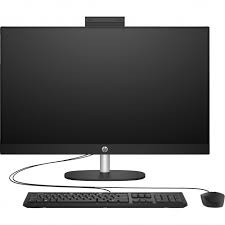

---

## 3. Блок живлення (Power Supply Unit - PSU)

Блок живлення перетворює змінний струм (AC) з розетки на постійний струм (DC), необхідний для компонентів комп'ютера.

### Форм-фактори блоків живлення:
* **AT (Advanced Technology):** Застарілий стандарт.
* **ATX (AT Extended):** Оновлена версія AT, але також вважається застарілою в чистому вигляді.
* **ATX12V:** Найпоширеніший сучасний стандарт. Має додатковий роз'єм для живлення процесора.
* **EPS12V:** Розроблений для серверів, зараз використовується в потужних настільних ПК.

### Характеристики напруги:
Різні компоненти потребують різної напруги:
* **3.3 В** та **5 В**: Використовуються цифровими схемами.
* **12 В**: Використовується для живлення двигунів (наприклад, у жорстких дисках) та вентиляторів.

### Конектори:
Блок живлення має різні роз'єми для підключення материнської плати (20 або 24 контакти), процесора, відеокарти та накопичувачів SATA/IDE.

> 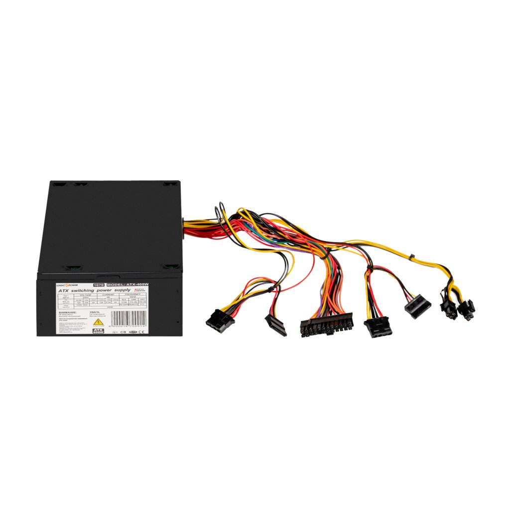
> 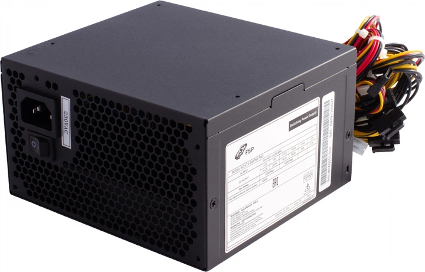

---

## 4. Основні компоненти материнської плати

Материнська плата (System Board) — це основна друкована плата, що з'єднує всі компоненти системи через шини (електропровідні доріжки).

### 7 ключових компонентів:

1.  **Центральний процесор (CPU):** "Мозок" комп'ютера. Інтерпретує та виконує команди. Встановлюється у спеціальний сокет (роз'єм).
    * *Типи сокетів:* PGA (ніжки на процесорі) та LGA (ніжки на сокеті).
    > 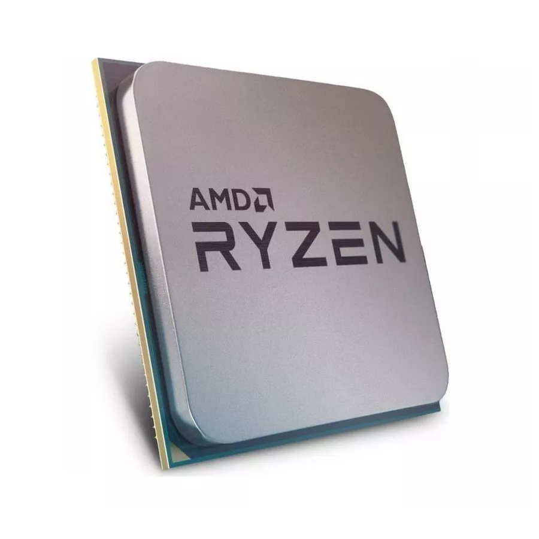
2.  **Оперативна пам'ять (RAM):** Тимчасове сховище для даних і програм, що виконуються в даний момент. Встановлюється у слоти пам'яті.
      > 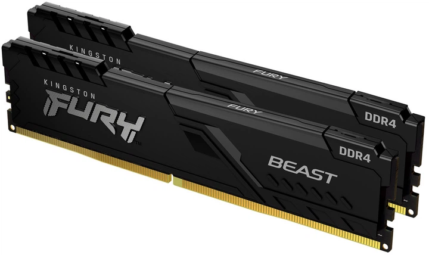
3.  **Слоти розширення (Expansion Slots):** Роз'єми (наприклад, PCIe), які дозволяють підключати додаткові адаптери (відеокарти, звукові карти тощо).
      > 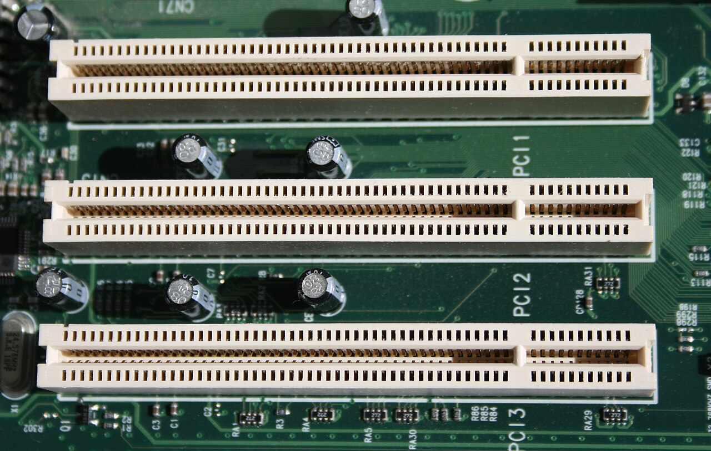
4.  **Чіпсет (Chipset):** Набір мікросхем, що керує потоками даних. Складається з двох мостів:
    * **Північний міст (Northbridge):** Забезпечує високошвидкісний зв'язок процесора з RAM та відеокартою.
    * **Південний міст (Southbridge):** Відповідає за повільніші компоненти: жорсткі диски, USB, слоти розширення.
    > 
5.  **BIOS / UEFI:** Мікросхема з прошивкою для ініціалізації обладнання при запуску (POST) та завантаження операційної системи. UEFI — сучасніша заміна традиційному BIOS.
    > 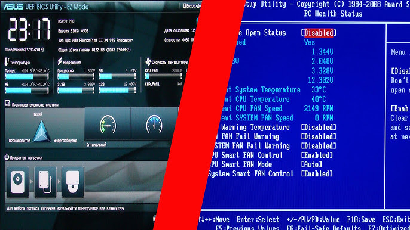
9.  **Внутрішні USB конектори:** Штиркові роз'єми на платі для підключення портів USB на передній панелі корпусу (наприклад, 19-контактний для USB 3.0 або 9-контактний для USB 2.0).
    > 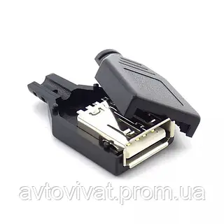
11.  **SATA роз'єми (Serial ATA):** Інтерфейс для підключення накопичувачів (HDD, SSD) та оптичних приводів. Підтримує "гарячу заміну".
     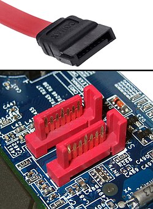

    
**Схема материнської плати**
> 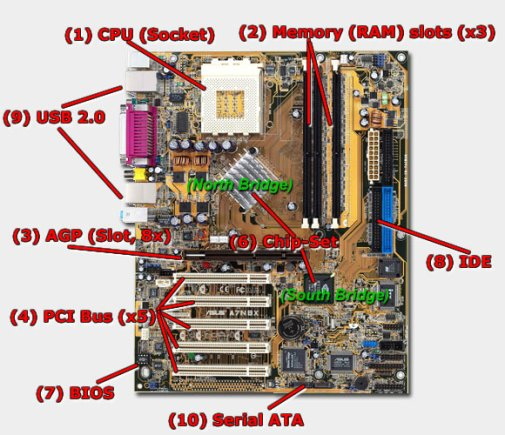
---
